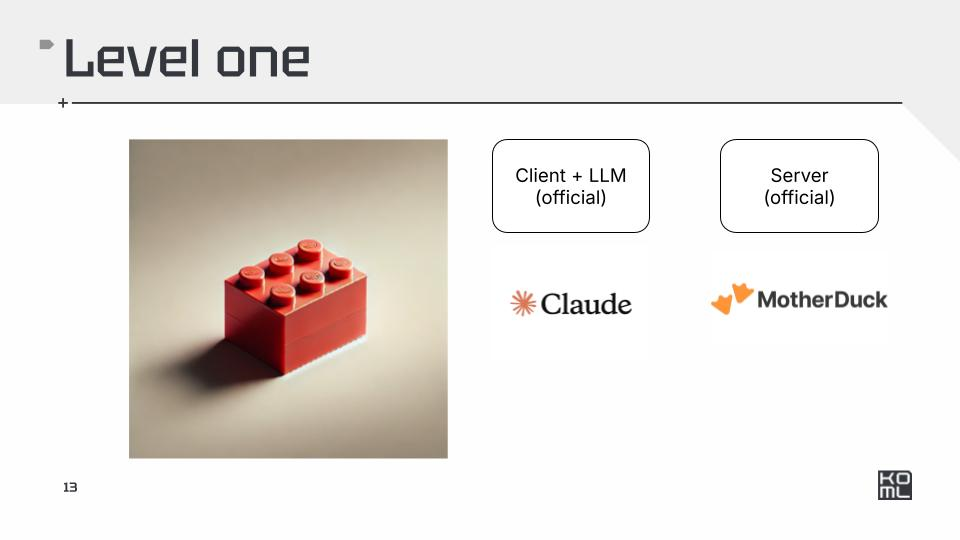
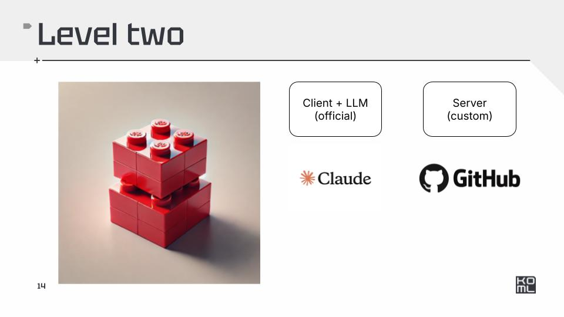

# mcp-webinar

## Level one




- https://github.com/motherduckdb/mcp-server-motherduck
- https://huggingface.co/datasets/ibm-research/nestful
- https://duckdb.org/2024/05/29/access-150k-plus-datasets-from-hugging-face-with-duckdb.html


## Level Two




```
uv pip install "mcp[cli]"
mcp install ./src/server_github.py 
```


- https://github.com/kyryl-opens-ml/ml-in-production-practice/


## Level Three


```
uv run ./src/client_custom.py ./src/server_github.py
```

## Debug

```
npx @modelcontextprotocol/inspector uvx mcp-server-motherduck
mcp dev ./src/server_github.py 
```

